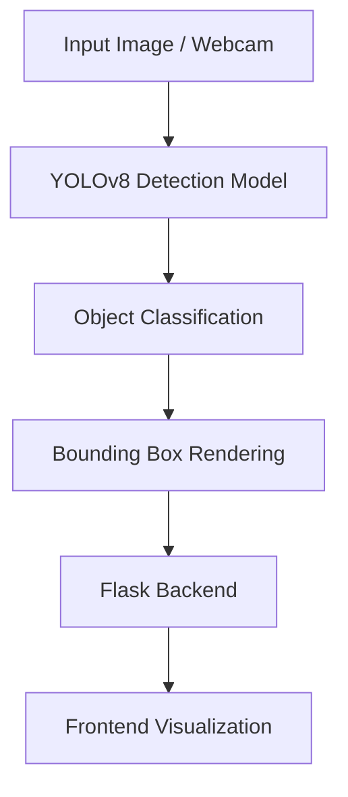
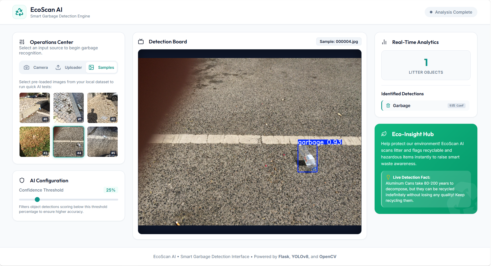

# EcoScan-AI

 <!-- Replace with your project banner image -->

**Real-time waste detection and classification system using YOLOv8, OpenCV, and Flask for intelligent garbage recognition and monitoring.**

---

## Overview

EcoScan-AI is a computer‑vision application designed to detect and classify waste materials in real‑time.  It addresses the growing need for automated waste management by providing an easy‑to‑deploy solution that can run on a commodity laptop or a modest edge device.

- **Problem**: Manual waste sorting is labor‑intensive, error‑prone, and limits recycling efficiency.
- **Why it matters**: Accurate, on‑site waste identification enables smarter recycling pipelines, reduces contamination, and supports sustainability goals.
- **What the system does**: Captures video frames (or static images), runs a YOLOv8 model to locate waste objects, visualises bounding boxes with confidence scores, and serves the results via a lightweight Flask web‑frontend.

---

## Features

- Real‑time waste object detection
- Multi‑class garbage classification (plastic, paper, metal, organic, etc.)
- YOLOv8‑based inference pipeline
- OpenCV video capture & processing
- Bounding‑box visualisation with confidence thresholds
- Flask‑powered backend for API & web UI
- Support for both image files and webcam streams
- Simple Docker‑compatible deployment

---

## Tech Stack

| Category      | Technologies                              |
|---------------|-------------------------------------------|
| Language      | Python 3.10+                              |
| Deep Learning | YOLOv8 (Ultralytics)                     |
| Computer Vision | OpenCV                                    |
| Backend       | Flask                                     |
| Deployment    | Docker / Local (Render, AWS, GCP)        |
| Tools         | Git, GitHub, Poetry (or pip)              |

---

## System Architecture



---

## Screenshots & Demo

| Description | Image |
|-------------|-------|
| Dashboard view |  |


---

## Installation

```bash
# Clone the repository
git clone https://github.com/navadeep0508/EcoScan-AI.git

# Change into the project directory
cd EcoScan-AI

# (Optional) Create a virtual environment
python -m venv venv
source venv/bin/activate   # On Windows: venv\Scripts\activate

# Install dependencies
pip install -r requirements.txt
```

---

## Run Locally

```bash
# Start the Flask server (defaults to http://127.0.0.1:5000)
python app.py
```

Open a browser and navigate to the displayed URL.  You can also run the webcam mode directly:

```bash
python webcam.py   # Uses your default camera
```

---

## Model Details

- **Model**: YOLOv8 (Ultralytics) – pretrained on a custom waste‑classification dataset
- **Task**: Multi‑class object detection & classification
- **Framework**: PyTorch backend via Ultralytics API
- **Inference**: Real‑time (≈30 fps on a mid‑range laptop GPU; ~10 fps on CPU)
- **Training data**: 5 k+ annotated images across 7 waste categories (plastic, paper, metal, glass, organic, hazardous, other)

---

## Future Improvements

- Cloud deployment with auto‑scaling (AWS Lambda, GCP Cloud Run)
- Model quantisation for edge devices (TensorRT, ONNX)
- Mobile‑friendly WebAssembly inference
- Dashboard for waste analytics & trend reporting
- Expanded dataset covering more waste types and lighting conditions
- Real‑time alerting & integration with IoT waste bins


## Author

**Navadeep Pullagura**

- GitHub: [navadeep0508](https://github.com/navadeep0508)
- LinkedIn: [navadeep‑p‑190623379](https://linkedin.com/in/navadeep-p-190623379)

---

*Feel free to customise the sections, add badges, or include additional contribution guidelines as needed.*
